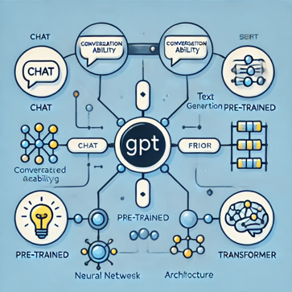

# AI Introduction <!-- omit from toc -->

- [1. Definition and scope of Artificial Intelligence](#1-definition-and-scope-of-artificial-intelligence)
  - [1.1. Scope of AI](#11-scope-of-ai)
  - [1.2. Example applications](#12-example-applications)
  - [1.3. Key characteristics of AI systems](#13-key-characteristics-of-ai-systems)
- [2. Introduction to ChatGPT](#2-introduction-to-chatgpt)
  - [2.1. ChatGPT’s interface and capabilities](#21-chatgpts-interface-and-capabilities)
    - [2.1.1. Interface Overview](#211-interface-overview)
    - [2.1.2. Capabilities](#212-capabilities)
    - [2.1.3. Limitations](#213-limitations)
  - [2.2. Examples of using ChatGPT](#22-examples-of-using-chatgpt)
    - [2.2.1. What is a prompt in ChatGPT](#221-what-is-a-prompt-in-chatgpt)
    - [2.2.2. Characteristics of a Prompt](#222-characteristics-of-a-prompt)
    - [2.2.3. Examples](#223-examples)
    - [2.2.4. Summary of a recent AI milestone, such as OpenAI's GPT advancements](#224-summary-of-a-recent-ai-milestone-such-as-openais-gpt-advancements)
  - [2.3. Answer basic questions about AI history and applications](#23-answer-basic-questions-about-ai-history-and-applications)
    - [2.3.1. Brief AI history](#231-brief-ai-history)
    - [2.3.2. AI Applications](#232-ai-applications)
- [3. Hands-on exercises using prompts](#3-hands-on-exercises-using-prompts)
  - [3.1. Summarize a real-world AI application using ChatGPT](#31-summarize-a-real-world-ai-application-using-chatgpt)
  - [3.2. Summarize how AI is used in healthcare for cancer diagnosis](#32-summarize-how-ai-is-used-in-healthcare-for-cancer-diagnosis)
- [4. Appendix](#4-appendix)
  - [4.1. Genomic and imaging cancer diagnosis](#41-genomic-and-imaging-cancer-diagnosis)
- [5. References](#5-references)

## 1. Definition and scope of Artificial Intelligence

AI is a branch of computer science focused on building systems capable of
performing tasks that typically require human intelligence. 

These tasks include understanding natural language, recognizing patterns, making decisions, and solving problems.

### 1.1. Scope of AI

- **Narrow AI** (specialized systems). AI designed to perform a specific task, such as virtual assistants (e.g., Siri, Alexa) or recommendation engines (e.g., Netflix, Amazon).

- **General AI** (theoretical concept). AI capable of performing any intellectual task a human can do, with reasoning and understanding across multiple domains.

- **Key fields within AI**. Machine learning, natural language processing, computer vision, robotics, and expert systems.

### 1.2. Example applications

- Healthcare. AI-powered diagnostic tools.
- Automotive. Self-driving cars.
- Daily life. Smart home devices.

### 1.3. Key characteristics of AI systems

- Perception: The ability of AI systems to interpret and process sensory data. For example:
- Vision: Detecting objects in images using computer vision algorithms
- Speech: Converting spoken language into text using speech recognition technologies.
- Reasoning: The ability to infer conclusions and make logical decisions based on data and rules. For example:
  - Deductive reasoning: Using existing knowledge to draw specific conclusions (e.g., expert systems diagnosing diseases).
  - Inductive reasoning: Learning patterns from data and generalizing
- Decision-Making: The capacity to choose the best course of action among various alternatives. For example:
  - Autonomous systems like drones or self-driving cars deciding optimal navigation paths.
  - Recommendation systems suggesting products or content based on user preferences.

- Learning: The ability to improve performance over time through experience. Examples include machine learning algorithms that refine predictions as more data becomes available.

## 2. Introduction to ChatGPT

ChatGPT stands for **Chat Generative Pre-trained Transformer**.

- **Chat**. Refers to its conversational abilities, designed to engage in natural language dialogue with users.
- **Generative**. Highlights its capability to generate coherent and contextually appropriate responses based on input.
- **Pre-trained**. Indicates that the model is trained on large datasets beforehand, enabling it to understand and respond effectively.
- **Transformer**. Refers to the architecture underlying the model, which uses a mechanism of attention to understand and generate text. This is part of the transformer neural network framework introduced in the groundbreaking paper **Attention Is All You Need** (2017).

The following image visually explains the components of ChatGPT, emphasizing the relationships among its parts: "Chat," "Generative," "Pre-trained," and "Transformer."

Each concept is represented with a descriptive label and icon to
enhance understanding.

ChatGPT is part of OpenAI's family of large language models (LLMs) and showcases advancements in AI-driven communication and reasoning.

### 2.1. ChatGPT’s interface and capabilities

#### 2.1.1. Interface Overview

ChatGPT provides a user-friendly interface where users can type prompts into a text box and receive AI-generated responses in real time.

Features include:

- Text input field for entering queries or instructions.
- Chat history that retains a conversation context for a session.
- Optional features like exporting chats or providing feedback on responses.

#### 2.1.2. Capabilities

- **Conversational Assistance**. Responds to questions, provides explanations, and generates ideas for various topics.
  - Example: "Explain the basics of neural networks in simple terms."

- **Content Generation**. Drafts essays, articles, emails, and code snippets.
  - Example: "Write an email inviting a guest speaker to our AI workshop."

- **Programming Assistance**. Debugs code, explains algorithms, and writes scripts.
  - Example: "Fix this Python code snippet for loading a dataset."

- **Brainstorming**. Generates creative ideas, such as project proposals or story concepts.
  - Example: "Suggest three innovative applications for AI in education."

- **Learning and summarize**. Summarizes articles, simplifies complex topics, and provides study guides.
  - Example: "Summarize the key points from an article on reinforcement learning."

- **Tips for Effective Use**.

  - **Be specific with prompts**. Clearly describe the task or question
  - **Experiment with rephrasing**. Try different ways to ask a question for improved responses.
  - **Provide context**. If working on a multi-step task, remind ChatGPT of earlier steps.

#### 2.1.3. Limitations

- ChatGPT does not access live internet data and is limited to its training knowledge.
- Responses might not always be accurate or contextually perfect.
- It relies on user input for maintaining context in complex discussions.

### 2.2. Examples of using ChatGPT

#### 2.2.1. What is a prompt in ChatGPT

A prompt is the **input or question provided by a user to initiate a conversation or request a response**. It serves as the starting point for the model to generate relevant and contextually appropriate outputs.

#### 2.2.2. Characteristics of a Prompt

- User's request. The text you type, whether it's a question, command, or description (e.g., "Explain quantum mechanics in simple terms").
- Context setting. A prompt can include specific details or instructions to shape the response (e.g., "Write a poem about autumn in a joyful tone").
- Scope.  Prompts can be short and open-ended or detailed and directive, affecting the depth and precision of the response.

#### 2.2.3. Examples

- Simple prompt. "What is the capital of France?"
- Complex prompt. "Summarize the key factors contributing to climate change and suggest potential solutions."

In essence, the quality and specificity of the prompt greatly influence the relevance and accuracy of the generated output.

#### 2.2.4. Summary of a recent AI milestone, such as OpenAI's GPT advancements

A recent milestone in AI development is OpenAI's upcoming release of its latest model, code-named **Orion**. This model is expected to significantly surpass the capabilities of GPT-4 and its variants, with advancements in reasoning, multimodal processing, and handling complex tasks. 

Set to debut either by the end of 2024 or early 2025, Orion is rumored to feature over **1.5 trillion parameters**, making it one of the largest and most powerful language models to date.

Key features anticipated in Orion include the following:

- **Enhanced reasoning abilities**.
- **Larger context window for processing extensive data inputs**.
- **Expanded multimodal capabilities that integrate text, audio, and image inputs**.

These advancements aim to move OpenAI closer to its goal of achieving **artificial general intelligence** (AGI) while **maintaining a strong focus on ethical AI development**. For example, new safety protocols like **watermarking AI-generated content** and **avoiding the use of personal data** in training aim to mitigate potential misuse​

Orion will initially be accessible to select partners, such as Microsoft, for integration into specialized applications, allowing thorough testing before a public release​. This strategic rollout positions OpenAI at the forefront of AI innovation as it prepares for the broader implications of such transformative technologies.

### 2.3. Answer basic questions about AI history and applications

#### 2.3.1. Brief AI history

1. Early Foundations (1940s-1950s)

   - The concept of AI emerged from **Alan Turing's work**, including the Turing Test, introduced in 1950, which aimed to measure a machine's ability to exhibit intelligent behavior indistinguishable from humans.
   - The development of early computers allowed researchers to explore the possibility of programming machines to "think."
  
1. Birth of AI as a Field (1956)

   - The term "**artificial intelligence**" was coined at the **Dartmouth Conference**, which laid the foundation for AI research.

1. Early success and challenges (1950s-1970s)

   - Initial progress included programs solving mathematical problems and proving theorems. However, limitations in computing power and funding led to periods known as the "**AI Winters**."

1. Resurgence and Modern AI (1980s-Present)

   - Advances in **machine learning**, **neural networks**, and **increased computational power** reignited AI progress. Key milestones include 
     - IBM's Deep Blue defeating chess champion Garry Kasparov in 1997.
     - Advent of deep learning in the 2010s, **powering modern AI like GPT models and autonomous systems**.

#### 2.3.2. AI Applications

The following applications showcase AI's transformative potential across diverse sectors. 

1. Healthcare

    - AI assists in diagnosing diseases, predicting patient outcomes, and optimizing treatment plans. For example, algorithms analyze medical images to detect anomalies like tumors.

1. Transportation

   - Self-driving cars and traffic management systems use AI to improve safety and efficiency. Companies like Tesla and Waymo are leading advancements in autonomous vehicle technology.

1. Finance

   - AI is employed in fraud detection, credit scoring, and algorithmic trading, making financial systems faster and more secure.

1. Customer service

   - AI chatbots and virtual assistants (like ChatGPT) handle customer inquiries, streamlining support processes for businesses.

1. Creative industries

   - AI generates art, music, and content, assisting creators in producing innovative works.

1. Education

   - Personalized learning platforms leverage AI to adapt educational content to individual student needs.

1. Environmental science

   - AI aids in climate modeling, disaster prediction, and developing sustainable solutions like optimizing energy use.

## 3. Hands-on exercises using prompts

### 3.1. Summarize a real-world AI application using ChatGPT

### 3.2. Summarize how AI is used in healthcare for cancer diagnosis

AI has revolutionized cancer diagnosis by enhancing accuracy, efficiency, and early detection. Here are the key ways it is applied. 

1. Medical imaging analysis

- AI algorithms analyze radiology images like **X-rays**, **CT scans**, and **MRIs** to detect tumors, often identifying anomalies earlier than traditional methods. For instance, AI can detect subtle patterns in mammograms to identify breast cancer.

1. Pathology support

    - AI tools examine biopsy samples, using pattern recognition to identify cancerous cells in histopathology slides. This accelerates diagnoses and reduces human error.

1. Risk prediction and screening

   - Machine learning models analyze patient histories, genetic data, and lifestyle factors to predict cancer risks and recommend preventive screenings.

1. Genomic analysis

   - AI interprets genetic mutations from sequencing data, identifying actionable insights for personalized cancer treatments, such as targeted therapies.
  
1. Integration with wearable technology

    - AI systems integrated with wearable devices monitor physiological data, helping in the early detection of conditions potentially leading to cancer.

By streamlining diagnostic processes and offering predictive capabilities, AI supports clinicians in making timely, data-driven decisions, ultimately improving patient outcomes.

## 4. Appendix

### 4.1. Genomic and imaging cancer diagnosis

What are the companies and research centers that use AI in **genomic** and

**imaging** analysis for cancer diagnosis? Do they accept patients for clinical trials?

Several companies and research institutions use artificial intelligence (AI) to enhance genomic and imaging analysis for cancer diagnosis, and many are involved in clinical trials. For more inforamtion, see [AI cancer diagnosis](AI-cancer-diagnosis.md).

## 5. References 

